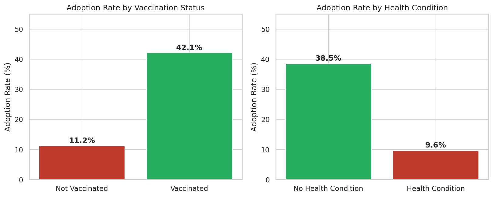
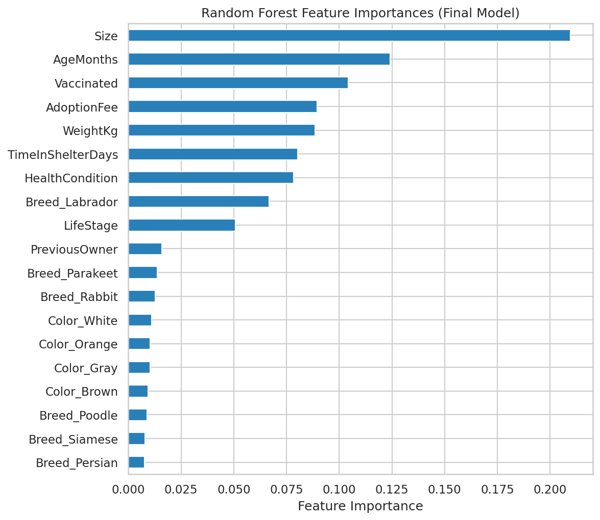
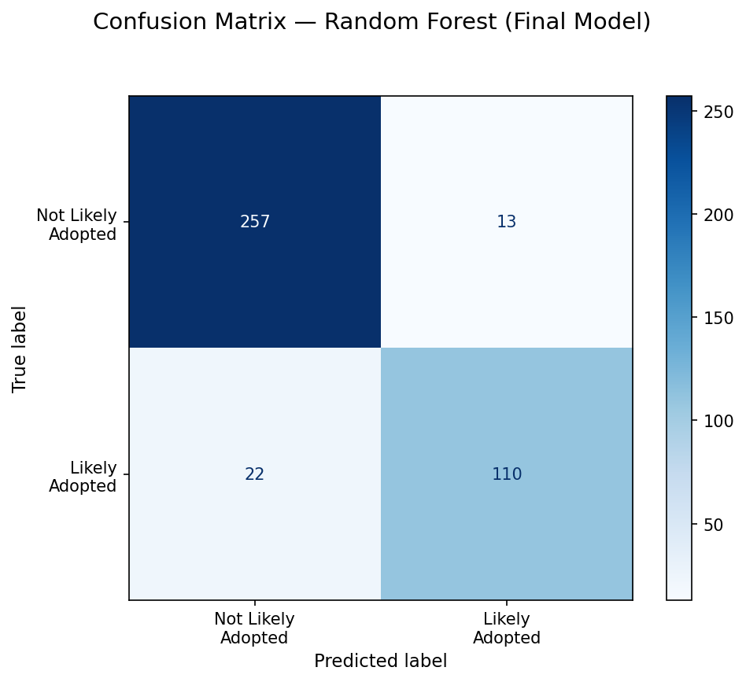

# Optimizing Animal Shelter Outcomes: Predicting Adoption Likelihood

**A classification model that predicts, at intake, whether a shelter animal is likely to be adopted — built to help shelter staff prioritize resources, medical care, and marketing where they matter most.**

---

## The Problem

Animal shelters operate under real constraints: limited kennel space, tight veterinary budgets, and staff stretched thin. Every extra day an animal spends unadopted adds cost and risk — and shelters often have no data-driven way to know, at intake, which animals are most likely to need extra help finding a home.

This project builds a model that closes that gap. Using 2,007 shelter animal records, it predicts adoption likelihood from traits available on day one — species, breed, age, health status, vaccination, size, and more — so operations, veterinary, and marketing teams can act early instead of reacting late.

## Key Findings

| Finding | Result |
|---|---|
| **Vaccination status** is the single biggest actionable lever | Vaccinated animals adopted at **42.1%** vs. **11.2%** for unvaccinated (~3.8×) |
| **Health condition** is a statistically significant barrier | 38.5% adoption rate (healthy) vs. **9.6%** (health condition) — χ² = 118.24, **p < 0.001** |
| **Species** matters | Dogs adopt at **46.4%**, notably higher than birds (30.2%), cats (28.7%), or rabbits (25.4%) |

<p align="center">
  
</p>

## Results

Three classification algorithms were trained and tuned via 5-fold cross-validated grid search, plus a majority-class baseline for context. **F1 score** was used as the primary metric rather than raw accuracy, since the target is imbalanced (~33% adopted) and accuracy alone can look good while missing every true adoption.

| Model | Accuracy | Precision | Recall | F1 | ROC-AUC |
|---|---|---|---|---|---|
| **Random Forest (final model)** | **0.913** | **0.894** | 0.833 | **0.863** | **0.895** |
| Decision Tree | 0.910 | 0.881 | **0.841** | 0.860 | 0.887 |
| Logistic Regression | 0.699 | 0.531 | 0.720 | 0.611 | 0.796 |
| Baseline (majority class) | 0.672 | 0.000 | 0.000 | 0.000 | 0.500 |

**Final model:** Random Forest Classifier — 100 trees, entropy split criterion, unrestricted depth, balanced class weights (selected via `GridSearchCV`). Full hyperparameters, feature list, and metrics are in [`model_metrics.csv`](model_metrics.csv).

<p align="center">
  
  
</p>

The random forest's top predictors — size, age, and vaccination status — line up closely with the logistic regression's strongest coefficients (vaccinated +2.21, health condition −2.35), which is a good sign these relationships are real rather than an artifact of one algorithm. Full discussion of results, including a review of the model's misclassifications, is in the [project report](Capstone_Final_Report.pdf).

## Recommendations

1. **Vaccinate at intake, not on a delayed schedule.** The single largest, most controllable adoption-rate gap in the data.
2. **Fast-track veterinary care and marketing support for animals with a health condition.** The gap here is severe (9.6% vs. 38.5%) and statistically confirmed.
3. **Use model-predicted adoption likelihood to flag at-risk animals within 30 days of intake**, enabling species-specific adoption events and targeted outreach.

## Data

- **Source:** ["Predict Pet Adoption Status"](https://www.kaggle.com/datasets) dataset, Kaggle
- **Size:** 2,007 records, 13 raw features
- **Target:** `AdoptionLikelihood` (binary: 0 = not likely adopted, 1 = likely adopted)
- **Known limitations:** no behavioral/temperament data, no image data, and this is a Kaggle dataset rather than a live shelter feed — findings should be re-validated against real operational data before acting on them.

## Methodology

1. **Data Wrangling** — checked for missing values; reviewed numeric ranges for possible data-collection artifacts (e.g., age and length-of-stay caps).
2. **Exploratory Data Analysis** — univariate/bivariate analysis, correlation and multicollinearity checks, and a chi-square test confirming the health-condition/adoption relationship.
3. **Preprocessing** — dropped the redundant `PetType` field (fully captured by `Breed`), ordinal-encoded naturally-ordered features (`Size`, `LifeStage`), one-hot encoded nominal categoricals, and split 80/20 with stratification on the target.
4. **Modeling** — logistic regression, decision tree, and random forest, each tuned via 5-fold `GridSearchCV`. Gini vs. entropy was treated as a tunable hyperparameter rather than assumed in advance.
5. **Evaluation** — F1 score as primary metric, with accuracy, precision, recall, and ROC-AUC reported alongside; final model selected by highest F1 on the held-out test set.

Full step-by-step work, including all EDA visualizations, is in [`Adoption_Prediction_Model.ipynb`](Adoption_Prediction_Model.ipynb).

## Repository Structure

```
├── Adoption Prediction Model.ipynb   # Full analysis: wrangling, EDA, preprocessing, modeling
├── Capstone_Final_Report.pdf         # Written report: problem, approach, findings, recommendations
├── Capstone_Slide_Deck.pptx          # Stakeholder-facing slide deck
├── model_metrics.csv                 # Final model features, hyperparameters, and performance metrics
├── data/
│   └── pet_adoption_data.csv         # Raw dataset
├── figures/                          # Exported charts used in the report and this README
└── README.md
```

## Tools & Libraries

`Python` · `pandas` · `numpy` · `scikit-learn` · `matplotlib` · `seaborn` · `scipy` (statistical testing)

## Further Research

- Test gradient boosting (e.g., XGBoost) against the random forest.
- Model time-to-adoption as a survival-analysis problem rather than a binary outcome.
- Deploy the model to score animals in real time at intake.
- Validate the model's real-world 30-day identification rate against the original project's 70% target.

---

*Springboard Data Science Career Track — Capstone Two*
